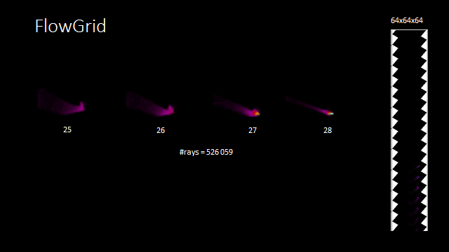

[![License][s1]][li]

[s1]: https://img.shields.io/badge/licence-GPL%203.0-blue.svg
[li]: https://raw.githubusercontent.com/matt77hias/FlowGridVisualization/master/LICENSE.txt

# FlowGridVisualization

## About
A visualization tool for FlowGrids.

## Use

~~~python
# Import a FlowGrid from a .txt file
from loader import load
flowgrid = load('FlowGrid.txt')

# Use one out of three methods for visualizing the FlowGrid 
from visualizer import plot_flowgrid, plot_flowgrid_stack, plot_flowgrid_dots
plot_flowgrid(flowgrid)
plot_flowgrid_stack(flowgrid)
plot_flowgrid_dots(flowgrid)  #could not scale
~~~
